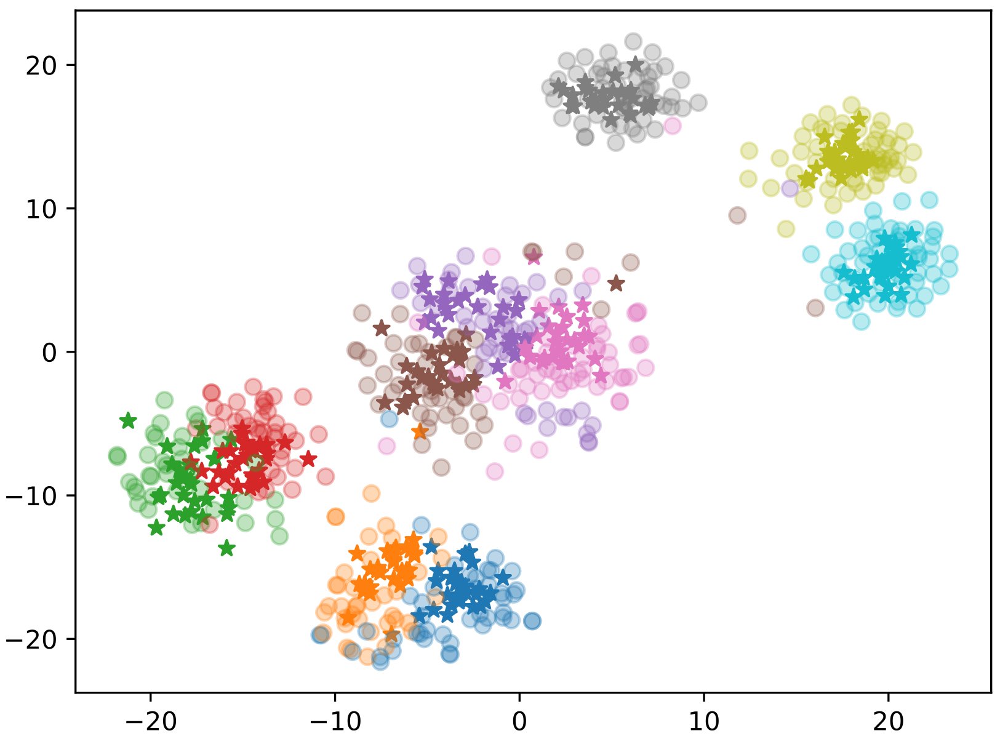
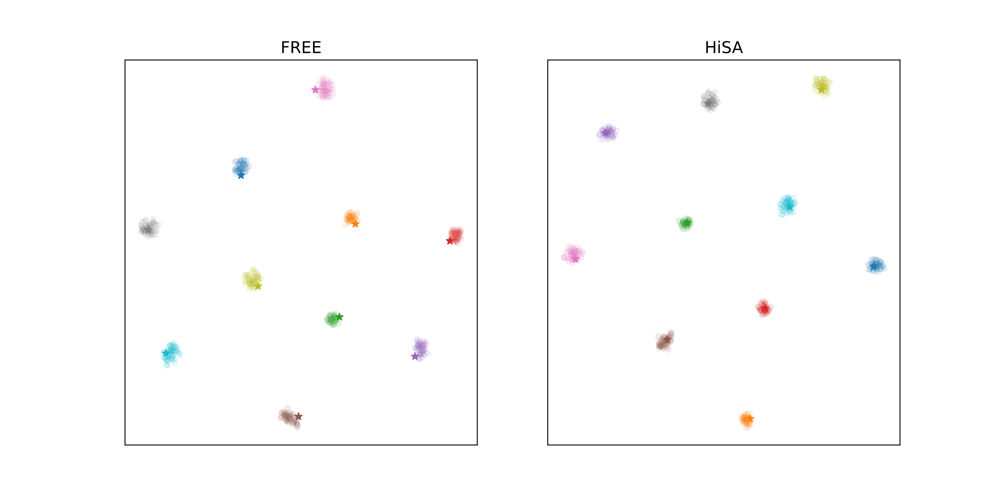

# ACM_MM_ID2213_Rebuttal
# Title: Hierarchical Semantic Augmentation for Generative Zero-Shot Learning

# 1. Reply to Reviewer zChZ's Q3.
We plot the t-SNE of the real features and the synthesized features generated by our method in one figure on CUB, which intuitively shows that our synthesized visual features are close to their corresponding real ones. The $\star$ and “$\circ$” indicate the synthesized features of our HiSA and real visual features, respectively. 10 colors represent 10 different categories.

# 2. Reply to Reviewer 9DtW's Q1.
We provide a t-SNE of our HiSA with FREE on CUB to show that our method achieves more accurate visual-semantic alignment. Here, the “$\star$” and “$\circ$” indicate the predefined semantic prototypes and reconstructed semantic features, respectively. 10 colors represent 10 different categories. It is easy to observe that our HiSA more accurately aligns the predefined semantic prototypes (the reconstructed features are centered on the predefined semantic prototypes).

